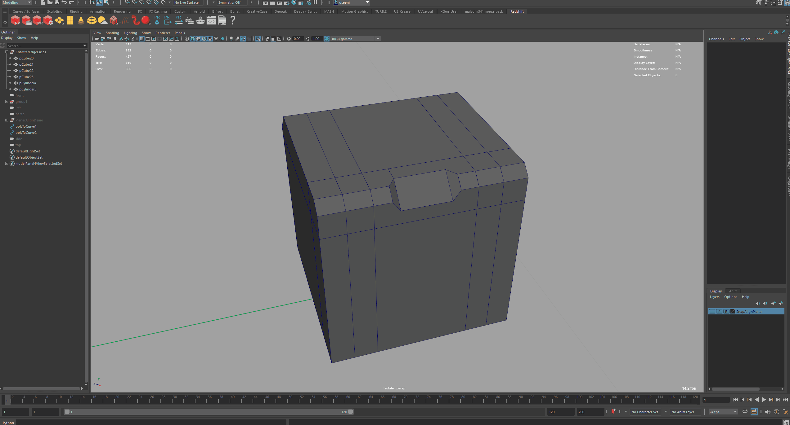
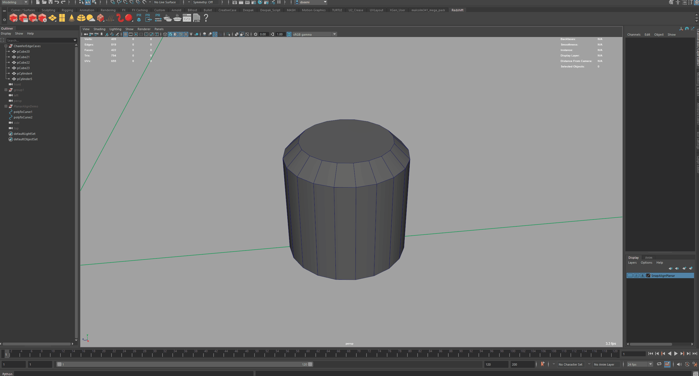
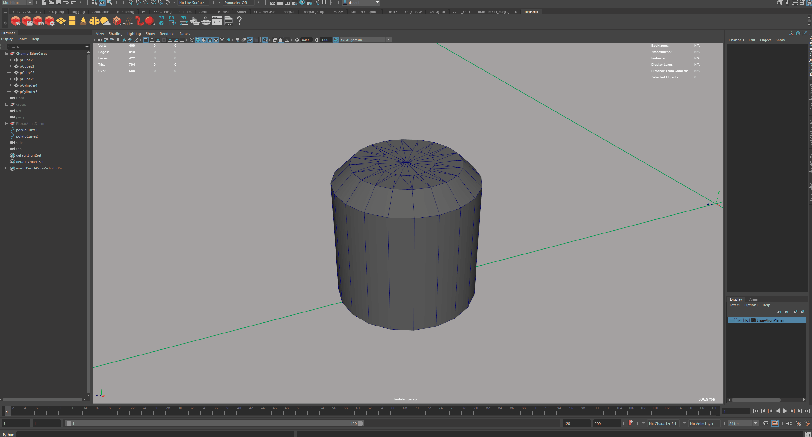
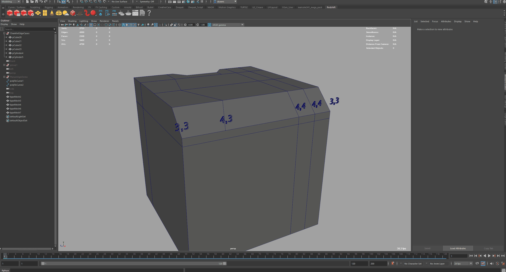
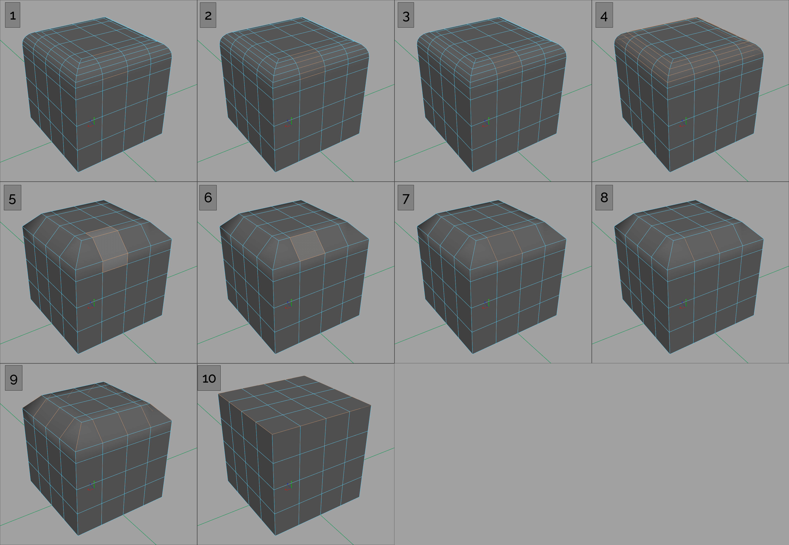
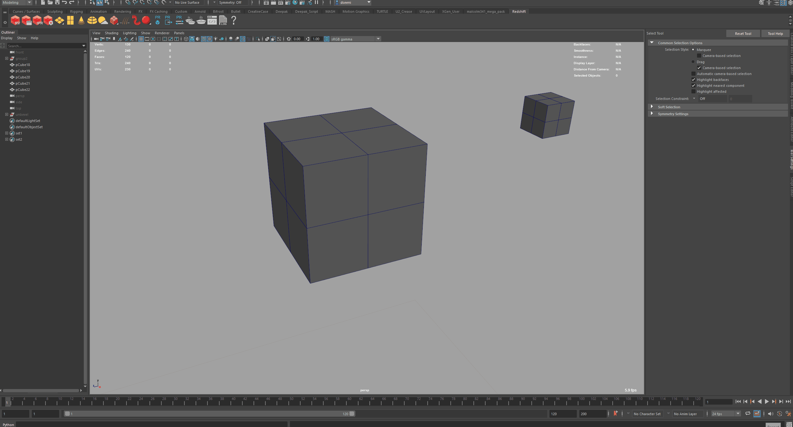
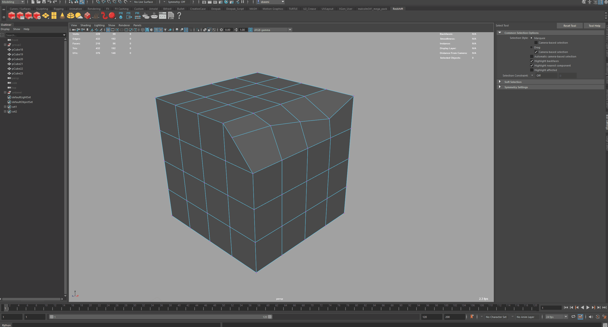
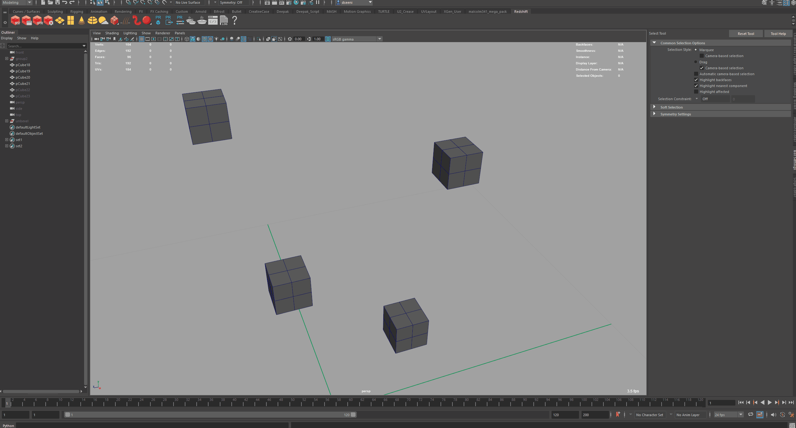
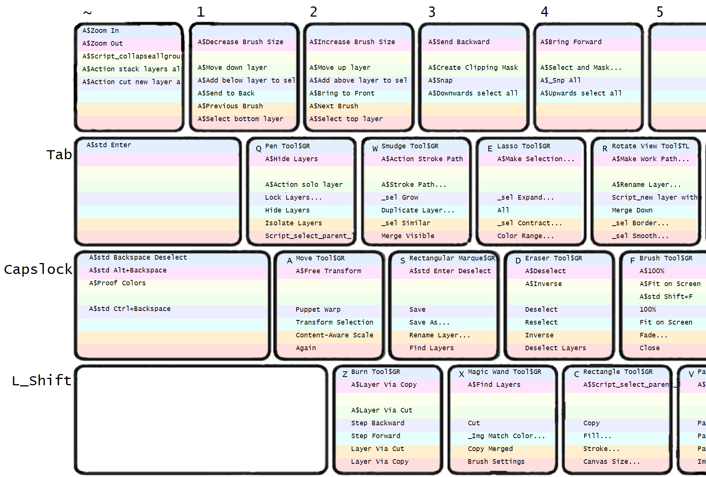

# Technical Art Demos

# Table of Contents
1. [Example](#example)

## Maya PolyUnchamfer & PolyUnbevel *(Geometric Reconstruction)*
### PolyUnchamfer & PolyUnbevel Demo


### PolyUnchamfer Project Overview:

#### Maya API 2.0: Fast Topological Querying, Sorting, and Vector Calculations

- Maya PolyUnbevel and PolyUnchamfer leverage the Maya Python API 2.0
(MIterators, MFNMesh etc.) for mesh traversal and topological sorting. MVector
and MMatrix are used for solver calculations.

- All the following scripts utilize a custom vector calculus / linear algebra
library within Maya API 2.0. In essence, it's an *augmented* version of Blender's
[mathutils.geometry](https://docs.blender.org/api/current/mathutils.geometry.html),
providing Linear Algebra and Vector Calculus solvers for a wide array of
intersection, projection, interpolation, and collision scenarios.

- Since all vector and matrix calculations are done
utilizing Maya API 2.0 exclusively, there is no dependency on NumPy and
backwards compatibility with Maya 2018 - 2022 is maintained without an
additional third-party package, simplifying distribution.

#### Maya Cmds: Undoable Component Transformation And Topology Merging
- Much of the heavy lifting for these tools is done within the Maya API.
After solver calculations and topological sorting are finished,
final mesh manipulation is pushed to Maya Cmds. This allows for PolyUnchamfer
and PolyUnbevel to take advantage of Maya's built-in Undo functionality without
the overhead of a custom polyModifier subclassed plugin. This represents a best
of both worlds approach, Maya API 2.0 for fast vector and matrix operations, as
well as pulling internal geometry data, and Maya Cmds for final geometry
manipulation and undo.

#### Performance Optimized: Minimized API Calls
- Much attention was paid into data organization during script execution. Since
API calls tend to incur a heavy performance penalty, at a high level, script
execution first deals with the Maya API exclusively, querying necessary
component level information with the MIterator classes, and making necessary
solver calculations with MMatrix and MVector. When transformation targets are
finalized, all component transformations are pushed to a single Maya CMDS call.
This allows for these tools to leverage Maya's built-in undo functionality,
despite heavy use of the Maya API.

#### *Edge-Vertex valence pairs are mapped to one of the following solvers*

#### Skew lines Closest Point of Approach
- *A 3D implementation of the Closest Point of Approach (CPA) Algorithm  for Collision Detection*
- [Distance of closest approach](https://en.wikipedia.org/wiki/Distance_of_closest_approach)
- [3d coordinate geometry skew lines](https://brilliant.org/wiki/3d-coordinate-geometry-skew-lines/)

#### Line Line Intersection
- [3D Line Intersections](https://mathemerize.com/point-of-intersection-of-two-lines-in-3d/)

#### Line Plane Intersection
- [Line Plane Intersection](https://handwiki.org/wiki/Line%E2%80%93plane_intersection)

#### Plane Plane Intersection
- [Dual Plane Intersection](https://brilliant.org/wiki/3d-coordinate-geometry-intersection-of-planes/)

#### Solvers are triggered on a per edge basis
- Leveraging Maya API 2.0 Mesh Function Sets, topological sorting per
edge solver is determined by the each edge's edge-vertex valence pair.
- *Valence refers to the number of connected edges per vertex, with
two vertices per selected edge*

#### Topological Inference Example:

- Lets take one edge within a potential PolyUnchamfer input selection as a simple example:

```
Let Vertex_A and Vertex_B comprise the edge-verticies of Edge1

Maya API edge sort return valence values per edge-vertex...

Vertex_A valance = 4
Vertex_B valance = 3

Valence pair values are then sorted in ascending order wherein (4,3) -> (3,4)

A valence pair of (4,3) => Line Plane Solver(3,4) for that edge

...

```

-----------------------------------------------------------------------

*In this way, each edge-vertex valence pair maps to one of the
solvers listed in the following section:*

**Recursive 3-Way Skew Lines Solver (4,4):**

```
The 3-Way Skew Solver is triggered when selected edge(s) belong to a
trianglualr face, such as in the case of corner chamfers.
```

<details>
  <summary>3-Way Solve Diagram</summary>


</details>


-----------------------------------------------------------------------
**Skew Line Solver (4,4):**
```
The most common case, wherein no precise edge vector intersection exists.
```


-----------------------------------------------------------------------
**Line Line Solver (4,4):**
```
The most straight-forward case, wherein a perfect vector intersection exists
and no CPA Skew solver is required.
```


-----------------------------------------------------------------------
**Plane Plane Solver (3,3):**
```
A rare topological case, such as a partially chamfered cube.
```


-----------------------------------------------------------------------
**Line Plane Solver (4,3):**
```
A common topological case when a cylinder whose top face is an N-gon is
chamfered or when you chamfer the top face of a cube.
```


-----------------------------------------------------------------------
**Multi-Line Plane / Skew Line Solver (4+,4):**
```
A rare topological case wherein there are more than 4 edges connected to one
Edge-Vertex (see example below).

In this instance, UnChamfer will run a skew lines solver on each potential edge
option, and select the edge that yields the minimum distance to intersection
(CPA), assuming no intersection is found.
```


-----------------------------------------------------------------------
**Labeled Edge-Vertex Valence Pairs:**



-----------------------------------------------------------------------

### PolyUnbevel Overview



#### PolyUnbevel can be summarized in these 10 steps:
<ol>
<li>User Selection: 2 Edges -- adjacent to the beveled geometry.</li>
	<ul>
	<li>The World-Space coordinates of each edge-vertex are stored for each
	edge, allowing for edge selection recorvery post topology modification,
	when vertex and edge IDs have changed and the original selection IDs
	are no longer valid.</li>
	</ul>
<li>Edge ring selection is triggered, selecting the interior edge loops.</li>
	<ul>
	<li>In the rare case that the partial edge ring selection edge count
	is greater than the outer ring, a 3 edge selection can be made to indicate
	which part of the edge ring to trigger unbevel on. (See Timelapse)</li>
	</ul>
<li>The original selection is excluded from the current ring selection.</li>
<li>This interior edge ring is extended full edge loops and deleted.</li>
<li>Edge and Vertex IDs have changed due to topological modification of the mesh.</li>
	<ul>
	<li>Using each original edge's World-Space coordinates, edge centers are
	calculated and projected to the mesh via Maya API calls to MPointOnMesh.</li>
	<li>A minimum delta vector is calculated between the original edge
	vector mid-point and the mid-point of each newly created edge. </li>
	<li> The original edge selections yield MPointOnMesh delta vectors with
	a magnitude close to 0.</li>
	<li>This allows recovery of the original edge selection, despite the
	edges having a newly assigned edge ID.</li>
	<li> The original edge selection is then converted to faces.</li>
	</ul>
<li>The common face amongst each 'ConvertToFaces' call is filtered and
selected.</li>
<li>The current face selection is converted to edges.</li>
<li>The original selection edges are removed.</li>
<li>Edge Ring selection is triggered.</li>
<li>PolyUnChamfer is called.</li>
</ol>

-----------------------------------------------------------------------
## Maya SnapAlign
### A new snapping system for Maya
- [x] Easily align and snap objects or components along an active axis or plane
during layout or modeling tasks
- [x] Aim lights, Aim Constraints, or align deformers when lighting or rigging
- [x] Avoid misclicks or undesired tool handle activation by implementing allowing snapping to work solely based on cursor position

#### SnapAlign includes all the snapping features found in Maya's native snapping system
- Axis Constraint Snap along axis *[X, Y, Z]*
- Object or Component full snap *[XYZ]*

#### SnapAlign appends the following features
- Object or Component Planar Snap along active tool handles *[XY, YZ, ZX]*
- Snap to edge center and face centers as well as components
- SnapAlign extends Maya's *Keep Spacing* to include components *and* objects for easy alignment and snapping

#### Snapping based on cursor position
- SnapAlign snaps to nearest component or object solely based on cursor position
- The cursor snap algorithm implements a similar algorithm to Maya's Pre-selection highlighting
- Converts between the PySide2/PyQt5 Screen Space coordinate system and the Maya API Screen Space coordinate system to determine the nearest component or object to the cursor without clicking

#### Edge Center and Face Center Snapping Demo


#### Planar Align Component Selections Demo


#### Planar Align Component Selections Demo


-----------------------------------------------------------------------
## Maya SmartActivate
### Tool handle activation and directional inference based upon cursor position
- [x] Activate gizmo tool handles closest to cursor without clicking
- [x] Modify Duplicate Special directions + or - (X, Y, Z) based on the cursor position relative to selected object's orientation axis
- [x] Easily transform deformers or joints by 90 degree increments based on cursor position
- [x] Avoid misclicks or undesired tool handle activation by allowing snapping to work solely based on cursor position
- [x] Easily Extensible to any other Maya tools, think of SmartActivate as a modifier to any Maya command that takes directional input

Based on Manipulator to Camera Space projection, SnapAlign can calculate the
nearest active tool handle to the cursor, it does this by first projecting
the gizmo axis onto the camera plane, then does a 2D vector angle calculation
between the projected gizmo axis angles (-X -Y -Z +X +Y +Z) and the cursor
to projected gizmo Vector, by finding the minimum delta vector, we can dervice
the "closest" active tool handle to cursor.
See the demo here:

#### Cursor Based Tool Handle Activation Demo


This can easily be extended to multiple tools, including duplicate special,
wherein the active axis for the duplicate operation is determined by the cursor
position! No more menus!

SnapAlign in action, with Smart Tool Handle Activation turned ON:

-----------------------------------------------------------------------
PRIMALIGN
Aligns objects to the component (edge center face center OR vertex normal)
under the cursor. If the object is a newly created primitive at world center
PrimAlign will move and bake the selected Object's Object Space -Y bounding box
to the the grid floor prior to alignment transform. This allows for predictable
alignment of the object's ground plane to the target geometry's alignment
plane.

Secondary Function, when an active axis of the move tool is selected and a component
is selected, PrimAlign will aim the active axis towards the component center.
Either edge center or face center for edges and faces, or vertex if a vertex is selected.

Relative spacing on or off to stack objects
Built a snapping system from the ground up
Calculates the face center of a polygon even if a real vertex does not exist
easy align objects
all the math same challenges data and math
select nearest face center
edge center
or vertex
purely based on cursor position no clicking
then snap and align
predictive
always Y UP
works with vertexs edges and faces too

-----------------------------------------------------------------------
PLANEFLATTEN
Consecutive Faces selected will align the first face to the second face ALONG
the connected edges as vector Angles

Seperated Face selections will porject along the vectors of each face, results
in a skew like effect per face towards the target plane alignment

Select 3 vertex of a non planar face and planar align that face while respecting
surround geometry

RECORD WITH PLANAR DETECTION ON
-----------------------------------------------------------------------

## SuperCharge Configurator
### An Extensible Hotkey Layout Optimizer Supporting Multiple DCC Applications

#### SuperCharge supports Maya, Photoshop, Zbrush, Fusion360, Moi3d, and 3DCoat so far!


#### Optimize Artist Workflows with a more efficient hotkey layout

- [x] Increase Artist Productivity with a fully customizable layout that
requires minimal setup time.
- [x] Reduce ulnar deviation and RSI by ergonomically prioritizing the home row
keys whilst still being flexible enough for full customization if needed
(including Left vs Right hand support).
- [x] Integrate new applications as production needs change with relative ease.
- [x] Integrate a Python to Autohotkey Parser, allowing for mapping overrides
that are not natively supported in a specific DCC application.
- [x] Autohotkey code is procedurally generated, dynamically updated,
commented, and documented for easy reference like so.

```Autohotkey
#IfWinActive ahk_exe Photoshop.exe
{
	; Decrease Brush Size <- The actual photoshop command name
	!1::
	{
	    SendInput, {[}
	    return
	}
	; ... repeat for every key
}
```
- [x] Fully automate the generation of a key map chart for each Application layout
within an HTML webpage, including Autohotkey mappings, allowing artists to
quickly reference an entire layout all at once.
- [x] Output native application configuration files, such as a UserConfig.kys
file (Photoshop), <HotKeyJSONString> XML (Fusion360), Moi.ini (Moi3d),
StartupHotkeys.txt (Zbrush), etc.
- [x] Provide utility functions for quick key map updates, diffing against
existing configurations, and backing up configurations using a SNV like Git.

#### Procedurally generating the Key Map Visualizer

Photoshop's Javascript API was utilized to generate the key map visualizer
procedurally.

Every key label has 8 associated slots for possible key maps.


Each Key label is a text layer in the PSD file.

Offset Vectors from each text layers coordinates were calculated for each
associated hotkey slot using the following script via the Photoshop API,
generating a unique empty text layer per modifier slot.

The PSD file was then output as HTML/CSS, exposing the slots for variable
input.

<details>
  <summary>GenerateKeyMapVisualizer.js</summary>

```javascript
var hkd = {
  "Print": [
    "std Print",
    "alt Print",
    "shift Print",
    "alt shift Print",
    "ctrl Print",
    "ctrl alt Print",
    "ctrl shift Print",
    "ctrl alt shift Print",
  ],
  "Pause": [
    "std Pause",
    "alt Pause",
    "shift Pause",
    "alt shift Pause",
    "ctrl Pause",
    "ctrl alt Pause",
    "ctrl shift Pause",
    "ctrl alt shift Pause",
  ],
  "Scroll Lock": [
    "std Scroll Lock",
    "alt Scroll Lock",
    "shift Scroll Lock",
    "alt shift Scroll Lock",
    "ctrl Scroll Lock",
    "ctrl alt Scroll Lock",
    "ctrl shift Scroll Lock",
    "ctrl alt shift Scroll Lock",
  ],
};

// ----------------------------------------------------------------------------
var doc = app.activeDocument;


function place_text(start_position, offset_position, sub_key_array, text_size) {
  for (var key in sub_key_array) {
    var layername = String(sub_key_array[key]);
    if (hkd.hasOwnProperty(sub_key_array[key])) {
      var textobjs = hkd[sub_key_array[key]];
    } else {
      continue;
    }
    doc.activeLayer = doc.artLayers.getByName(layername);
    var initial_position = [
      doc.activeLayer.bounds[0] + start_position[0],
      doc.activeLayer.bounds[1] + start_position[1],
    ];

    for (var value in textobjs) {
      if (null != textobjs[value]) {
        var newLayer = doc.artLayers.add();
        newLayer.kind = LayerKind.TEXT;
        newLayer.name = textobjs[value];
        newLayer.textItem.contents = textobjs[value];
        newLayer.textItem.size = text_size;
        newLayer.textItem.font = "Arial";
        var newpos = [
          initial_position[0] + offset_position[0] * (value + 1),
          initial_position[1] + offset_position[1] * (value + 1),
        ];
        newLayer.textItem.position = newpos;
      }
    }
  }
}

var std_spacing = [0, 3.4];
var text_pt = 13.5;

var std_offset = [25, 10];
var std_keys = [
  "Q",
  "W",
  "E",
  "R",
  "T",
  "Y",
  "U",
  "I",
  "O",
  "P",
  "L Sq Bracket",
  "R Sq Bracket",
  "Backslash",
  "A",
  "S",
  "D",
  "F",
  "G",
  "H",
  "J",
  "K",
  "L",
  "Semicolon",
  "Apos",
  "Z",
  "X",
  "C",
  "V",
  "B",
  "N",
  "Comma",
  "Period",
  "Forward Slash",
  "Numpad 1",
  "Numpad 2",
  "Numpad 3",
  "Numpad 4",
  "Numpad 5",
  "Numpad 6",
  "Numpad 7",
  "Numpad 8",
  "Numpad 9",
  "Numpad Asterisk",
  "Numpad Forward Slash",
  "Numpad Minus",
  "Numpad Plus",
];
place_text(std_offset, std_spacing, std_keys, text_pt);

var m_key_offset = [30, 10]; // offset unique due to hand placement variation
var m_keys = ["M"];
place_text(m_key_offset, std_spacing, m_keys, text_pt);

var fkey_offset = [6, 80];
var fkeys = [
  "F1",
  "F2",
  "F3",
  "F4",
  "F5",
  "F6",
  "F7",
  "F8",
  "F9",
  "F10",
  "F11",
  "F12",
];
place_text(fkey_offset, std_spacing, fkeys, text_pt);

var home_row_number_offset = [0, 72];
var home_row_number_keys = [
  "1",
  "2",
  "3",
  "4",
  "5",
  "6",
  "7",
  "8",
  "9",
  "0",
  "Minus",
  "Equals",
];
place_text(home_row_number_offset, std_spacing, home_row_number_keys, text_pt);

var capslock_offset = [216, 4];
var capslock_keys = ["Capslock"];
place_text(capslock_offset, std_spacing, capslock_keys, text_pt);

var backspace_offset = [0, 72];
var backspace_keys = ["Backspace"];
place_text(backspace_offset, std_spacing, backspace_keys, text_pt);

var tilde_offset = [0, 62];
var tilde_key_keys = ["Tilde"];
place_text(tilde_offset, std_spacing, tilde_key_keys, text_pt);

var tab_offset = [105, 10];
var tab_keys = ["Tab"];
place_text(tab_offset, std_spacing, tab_keys, text_pt);

var esc_offset = [0, 81];
var esc_keys = ["Esc"];
place_text(esc_offset, std_spacing, esc_keys, text_pt);

var numlock_offset = [-10, 104];
var numlock_keys = ["Numlock"];
place_text(numlock_offset, std_spacing, numlock_keys, text_pt);

var numpad_period_offset = [19, -277];
var numpad_period_keys = ["Numpad Period"];
place_text(numpad_period_offset, std_spacing, numpad_period_keys, text_pt);

var numpad_0_offset = [86, 15];
var numpad_0_keys = ["Numpad 0"];
place_text(numpad_0_offset, std_spacing, numpad_0_keys, text_pt);

var num_enter_key_offset = [8, -585];
var num_enter_key_keys = ["Numpad Enter"];
place_text(num_enter_key_offset, std_spacing, num_enter_key_keys, text_pt);

var right_arrow_offset = [8, -271];
var right_arrow_keys = ["Right"];
place_text(right_arrow_offset, std_spacing, right_arrow_keys, text_pt);

var left_arrow_offset = [4, -266];
var left_arrow_keys = ["Left"];
place_text(left_arrow_offset, std_spacing, left_arrow_keys, text_pt);

var up_arrow_offset = [7, 67];
var up_arrow_keys = ["Up"];
place_text(up_arrow_offset, std_spacing, up_arrow_keys, text_pt);

var down_arrow_offset = [5, -270];
var down_arrow_keys = ["Down"];
place_text(down_arrow_offset, std_spacing, down_arrow_keys, text_pt);

var delete_end_pgdn_offset = [0, -264];
var delete_end_pgdn_keys = ["Delete", "End", "Pg Dn"];
place_text(delete_end_pgdn_offset, std_spacing, delete_end_pgdn_keys, text_pt);

var R_Enter_offset = [-666, 20];
var R_Enter_keys = ["Enter"];
place_text(R_Enter_offset, std_spacing, R_Enter_keys, text_pt);

var R_Shift_offset = [-795, 18];
var R_Shift_keys = ["Enter", "R_Shift"];
place_text(R_Shift_offset, std_spacing, R_Shift_keys, text_pt);

var Space_LAlt_LWin_R_Alt_R_Ctrl_offset = [10, -270];
var Space_LAlt_LWin_R_Alt_R_Ctrl_keys = [
  "L_Alt",
  "L_Win",
  "R_Alt",
  "R_Ctrl",
  "Space",
];
place_text(
  Space_LAlt_LWin_R_Alt_R_Ctrl_offset,
  std_spacing,
  Space_LAlt_LWin_R_Alt_R_Ctrl_keys,
  text_pt
);

var insert_home_pgup_offset = [0, 72];
var insert_home_pgup_keys = [
  "Insert",
  "Home",
  "Pg Up",
  "Print",
  "Scroll Lock",
  "Pause",
];
place_text(
  insert_home_pgup_offset,
  std_spacing,
  insert_home_pgup_keys,
  text_pt
);

```
</details>



#### Binding UI display names to API names using Tesseract OCR and FuzzyWuzzy
  - In the case of Fusion360, at the time, custom keyboard shortcuts could only
  be saved one at a time from the user interface, and required multiple user
  prompts and menu selections.

  - Documentation for all possible commands via the API was available, but
  they did not accurately match the names present in the UI menus.

  - Since Users should only care about UI names for quick reference to key
  maps, a binding between UI names and API commands was required.

  - UI Commands were screenshotted and then processed in Photoshop using
  actions stripping out the color and leaving just a list of names.

- Images were run through [Google Tesseract](https://github.com/tesseract-ocr/tesseract)
OCR (Optical Character Recognition) functionality to extract text data
from screenshots, returning a CSV file of UI names.

- [Python FuzzyWuzzy](https://docs.blender.org/api/current/mathutils.geometry.html)
provided a [Levenshtein distance](https://en.wikipedia.org/wiki/Levenshtein_distance)
algorithm for fuzzy matching UI display names to API commands.

- Even if there were abbrevitions made to the diplay name of a command,
this technique worked for most UI names as long as there was some
similarity to their corresponding API commands.

```python
# #################################################### FUZZYWUZZY MATCH RESULTS
SampleFuzzyWuzzyOutput = [
	('std_F4', 'Shaded', 'SDK.MAGNestDisplayCmd.Shaded'),
	('alt_F4', 'Pattern Rectangular', 'ShapeRectangleCenter'),
	('shift_F4', 'Circular Pattern', 'CircularSketchPatternCommand'),
	('alt_shift_F4', 'Pattern on Path', 'PatternOnPath'),
	('ctrl_F4', 'pnt driven pattern', 'FusionDrawingCenterPatternEditCommand'),
	('ctrl_alt_F4', 'Create Mesh Section Sketch', 'MeshPlanarSectionCommand'),
	('ctrl_shift_F4', 'Compare Bodies', 'MeshCombineCommand'),
	('ctrl_alt_shift_F4', 'Background Canvas', 'FusionAddBackgroundCanvasCommand'),
	('std_F5', 'Appearance', 'PublisherAppearanceCommand'),
	('alt_F5', 'surface Reverse Normals', 'MeshReverseNormalsCommand'),
	('shift_F5', 'Section Analysis', 'FusionHalfSectionViewCommand'),
	('alt_shift_F5', 'Zebra Analysis', 'FusionZebraAnalysisCommand'),
	('ctrl_F5', 'Toggle Curvature Display', 'FusionToggleCurveCurvatureCombCommand'),
	('ctrl_alt_F5', 'Curvature Map Analysis', 'FusionCurvatureMapAnalysisCommand'),
	('ctrl_shift_F5', 'Curvature Comb Analysis', 'FusionCurvatureCombAnalysisCommand'),
	('ctrl_alt_shift_F5', 'Draft Analysis', 'FusionDraftAnalysisCommand'),
	('std_F6', 'New Design', 'NewDocumentCommand'),
	...
]
```

#### Dynamically Generated UI Toggle Switches

- Autohotkey emulation of some quality of life features that are present in
Maya and 3Ds-Max such as Wireframe On Shaded and Isolate Selection

- Toggle Switches were generated in Python and parsed into
the Autohotkey code below, dynamically merging two Fusion mappings into a ternary toggle switch.

- Toggle switches are dynamically generated by python, update when mappings
change, and are parsed and commented as Autohotkey bindings.

```autohotkey
; ################################################## FUSION360 TOGGLE CONSTANTS
WireframeOnShaded_TGL := 1
XRayOnShaded_TGL := 1
Incremental_TGL := 1
PaintSel_TGL := 1
Isolate_TGL := 1

; Wireframe On Shaded Toggle
F1::
{
    SendInput, % WireframeOnShaded_TGL = 1 ? ( "^{6}", WireframeOnShaded_TGL := 0 ) : ( "^{4}", WireframeOnShaded_TGL := 1 )
    return
}

; XRay View Mode Toggle
F4::
{
    SendInput, % XRayOnShaded_TGL = 1 ? ( "^{5}", XRayOnShaded_TGL := 0 ) : ( "^{6}", XRayOnShaded_TGL := 1 )
    return
}

; Incremental Move Toggle
F2::
{
    SendInput, % Incremental_TGL = 1 ? ( "{F2}", Incremental_TGL := 0 ) : ( "{F1}", Incremental_TGL := 1 )
    return
}

; Paint Selection Toggle
^Space::
{
    SendInput, % PaintSel_TGL = 1 ? ( "{3}", PaintSel_TGL := 0 ) : ( "{1}", PaintSel_TGL := 1 )
    return
}

; Isolate Selection Toggle
!CapsLock::
{
    SendInput, % Isolate_TGL = 1 ? ( "!{,}", Isolate_TGL := 0 ) : ( "^!{,}", Isolate_TGL := 1 )
    SetCapsLockState, AlwaysOff
    return
}
```

#### Integrating new applications

Integrating new applications requires the following steps
<ol>
<li> Binding UI commands to API commands</li>
<li> Parsing the target programs hotkey syntax to that of the Key Map Visualizer</li>
<li> Parsing the target programs hotkey syntax to autohotkey for overrides</li>
<li> Output a native hotkey file for integration into the host program</li>
</ol>

#### Photoshop .Kys File Internals
- Photoshop's .Kys format follows a standard XML schema layout

- Photoshop commands are registered internally with specific key and tool IDs.
This is because Image and Layer share common UI names.

- By flooding all assigned tools with a key mapping allowed for both unique
IDs to be extracted along with the API command name, binding them to the
non-unique UI names and tagging them when visualizing a key map chart.


