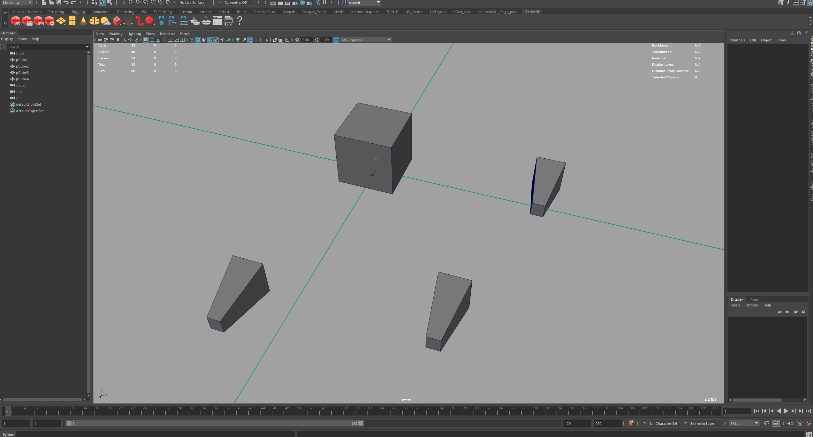
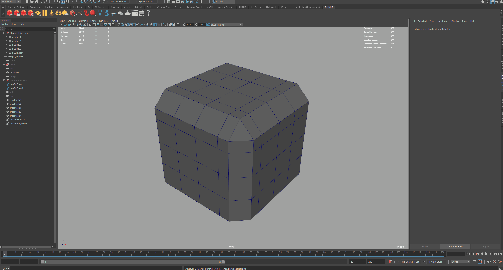
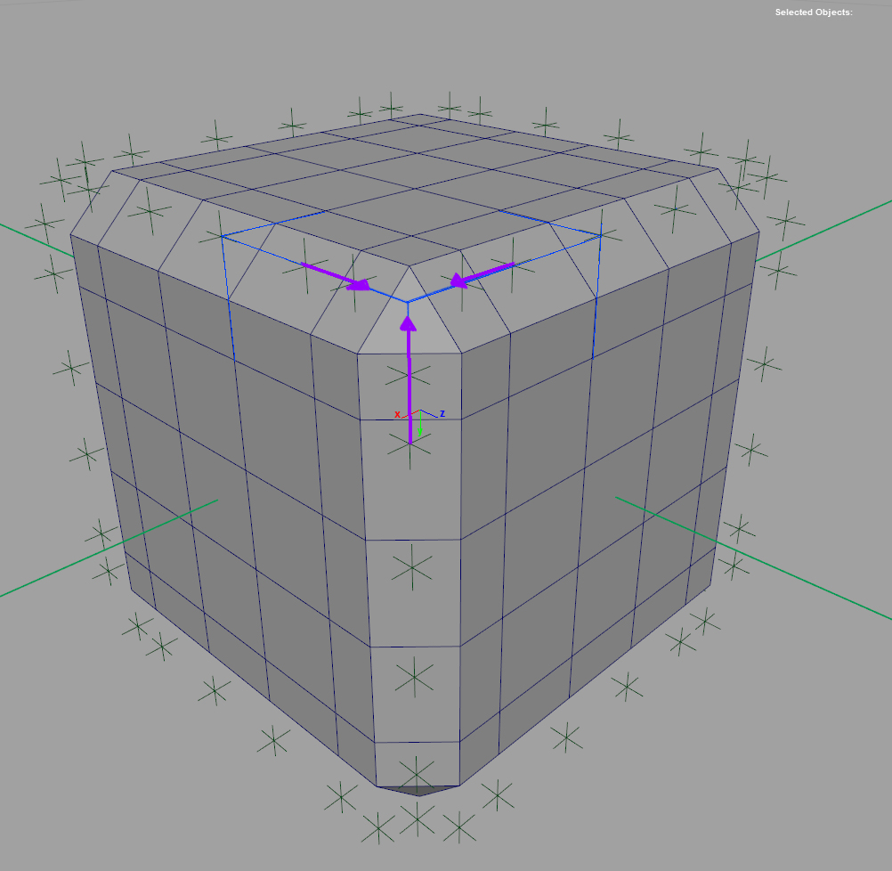
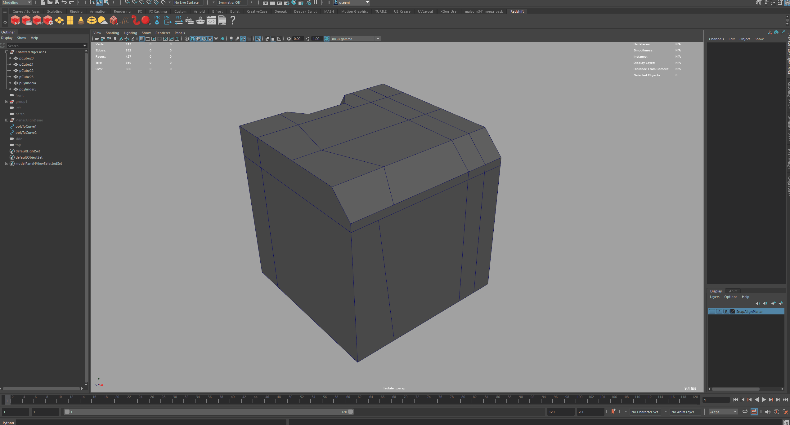
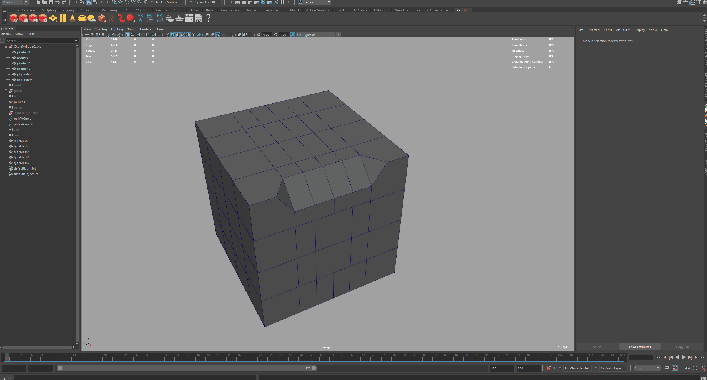

# Technical Art Demos

## Maya PolyUnchamfer & PolyUnbevel (Geometric Reconstruction)
- Implemented a Vector Calculus Library similar to Blender's mathutils.geometry,
covering a wide array of intersection and collision scenarios (see below)
- https://docs.blender.org/api/current/mathutils.geometry.html

### Maya API 2.0: Fast Topological Querying and Sorting
- Maya PolyUnbevel and PolyUnchamfer leverage the Maya Python Api 2.0 (MFNMesh etc.)for
mesh traversal and topological sorting. MVector and MMatrix are used for
solver calculations.

### Maya Cmds: Component Transformation And Topology Merging
- After solver calculations and topological sorting are done via the Maya API,
final mesh manipulation is pushed to Maya Cmds. This allows for PolyUnchamfer
and PolyUnbevel to take advantage of Maya's built-in Undo functionality.

### Prior to vertex transformation, selected edges are mapped via their edge-vertex
valence pairs to one of the following solvers:

#### Skew lines Solver
- A 3D implementation of the Closest Point of Approach Algorithim (CPA) for Collison Detection:
- https://en.wikipedia.org/wiki/Distance_of_closest_approach
- https://brilliant.org/wiki/3d-coordinate-geometry-skew-lines/

#### Line Line Intersection Solver
- https://mathemerize.com/point-of-intersection-of-two-lines-in-3d/

#### Line Plane Intersection Solver
- https://handwiki.org/wiki/Line%E2%80%93plane_intersection

#### Plane Plane Intersection Solver
- https://brilliant.org/wiki/3d-coordinate-geometry-intersection-of-planes/

#### Solvers are triggered on a per edge basis
- Leveraging Maya API 2.0 Mesh Function Sets, topological sorting per
edge solver is determined by the each edge's edge-vertex valence pair.
- *Valence refers to the number of connected edges per vertex, with
two vertices per selected edge*

#### Topological Sorting Example:

- Lets take one edge within a potential PolyUnchamfer input selection as a simple example:

```
Let Vertex_A and Vertex_B compromise of the verticies of Edge1:

Vertex_A valance = 4
Vertex_B valance = 3

Valences are sorted from min to max wherein (4,3) -> (3,4)

A valence pair of (3,4) => Line Plane Intersection Solver!
```

In this way, each additional solver is triggered by a unique edge vertex
valence pair as well:

-----------------------------------------------------------------------
**Double Skew Solver (4,4):**
```
- The Double Skew Solver is triggered when selected edge(s) belong to a
trianglualr face in the case of corner chamfers and no intersections exists.
```




-----------------------------------------------------------------------
**Skew Line Solver (4,4):**
```
- The most common case, where no precise intersection exists so Skew is called.
```


-----------------------------------------------------------------------
**Line Line Solver (4,4):**
```
- The easiest case wherein a perfect intersection exists and no CPA Skew solver
is required.
```


-----------------------------------------------------------------------
**Plane Plane Solver (3,3):**
```
- Rare topology case when you partial chamfer side of a cube
```

-----------------------------------------------------------------------
**Line Plane Solver (4,3):**
```
-  Common topology when you chamfer a cylinder whose top face is an N-gon or
when you chamfer the top of a cube
```


-----------------------------------------------------------------------
**Multi Line Plane Solver (4+,4):**
```
- A rare topological case wherein there are more than 4 edges connected to one
vertex edge (see example below).

In this instance UnChamfer will run a skew lines solver on each potential edge
option, and select the edge the yields the minimum distance to intersection
(CPA), assuming no intersection is found.
```

-----------------------------------------------------------------------


- Maya Api 2.0 topological queries result in blending between 3 solvers on a per edge basis
	determined by vertex
valence (connected edges per )

## A Generic Hotkey Configuration Optimizer
### SuperCharge Maya/Photoshop/Zbrush/Fusion360/Moi3d!!


-- Optimize Artist Workflows with a more efficent Hotkey layout
	---- Faster artists (more efficient)[x]
	---- Reduce Ulnar Deviation and RSI[x]
	---- Healthy artists = Happy artists (ergonomics)[x]

-- Extend and Document Artist settings automatically across multiple programs, including:
-- Photoshop
-- Maya
-- Fusion360
-- Moi3d
-- Zbrush

Parse Config Files and automatically generate an html page for easy reference:
-- (Maya):

-- (Photoshp):

Hotkey framework for program reconfiguration

Document the layout for east artist reference

Extend the assignable configuration keys via autohotkey
Maintainable
Have a repository per user where they can store it remotely and back it up as
well as view changes and make changes if needed

Photoshop example
Look at photoshops configuration file
reverse engineer the data storage format and ordering
derive 3 main command types
	static unique id
	dynamic no unique id
	tools stackable groups vs non stackable
Flood the UI with all possible keycombinations
build a map between UI representation of a command and its internal xml storage representation
determine a sort order for left vs right handed artists
log artist sessions in photoshop and sort most used vs least used commands according to frequency
reconfigure the ui to be most accessable to the artist
On top of that override photoshops reserved keys for things like brush size and layer manipulation
using autohotkey
Parsing photoshop style input sequences to autohotkey syntax hotkey strings
	output an authotkey file with these recursive maps

when I hit alt 1 I want to decrese brush size
again keeping the data self documenting I automatically generate a comment string as well

; Decrease Brush Size
!1::
{
    SendInput, {[}
    return
}

Finally combining both the recursive autohotkey maps as well as the photoshop
mappings I parse those sequence strings to be readable in html visualizer,
which is a simple webpage whose html slots (html hotkey sequence as
key)at each keyboard location take in a text string
(value)
 ------------------------------------------------------------------------------
## MAYA PROJECTS BREAKDOWN
Unchamfer ->
Using mayas lower level python api, which really is a procedurally generated
python api that has a 1 to 1 binding to its c++ api via SWIG
simplified wrapper and interface generator
https://www.swig.org/

Vector Line Intersection:
https://vicrucann.github.io/tutorials/3d-geometry-algorithms/#skew-lines-geometry-shortest-distance-and-projection-of-one-skew-line-onto-another
http://paulbourke.net/geometry/pointlineplane/

CPA algorithim:
https://core.ac.uk/download/pdf/74237799.pdf

Alternate case:
non perfect intersections = CPA solver take the minimum on each vector then average

EdgeCase:
corner bevels of a 3 way intersection (triangle corner) Cpa Solving
This required recursive bevel operations, performing the solver twice

The first challenge apart from building a math library that did not exist in
maya (extending the API) was
mesh traversal
how to traverse along an edge loop or ring
how to identify branch points (triangles)
how to organize and store the data in such a way that I know the directions
of each vector, what to input where, and keep tract of what to finall move
to a resulting location

at triangles
	how to do recursive 3 way solvers between A B C vectors

(Something I think would be useful in our javascript performance issue)
Performance issues, cmds wasnt cutting it and api forces you to compact your
data into arrays and reduce the api calls by tightly organizing your data
calling eveyrthing you need at once and sorting it yourself.

CmdsSnapalign
Relative spacing on or off to stack objects
Built a snapping system from the ground up
Calculates the face center of a polygon even if a real vertex does not exist
easy align objects
all the math same challenges data and math
select neraest face center
edge center
or vertex
purely based on cursor position no clicking
then snap and align
predictive
always Y UP

Smart Tool Handle Activation: (Lazy Boi Mode)
Based on Manipulator to Camera Space projection, SnapAlign can calculate the
nearest active tool handle to the cursor, it does this by first projecting
the gizmo axis onto the camera plane, then does a 2D vector angle calculation
between the projected gizmo axis angles (-X -Y -Z +X +Y +Z) and the cursor
to projected gizmo Vector, by finding the minimum delta vector, we can dervice
the "closest" active tool handle to cursor.
See the demo here:

This can easily be extended to multiple tools, including duplicate special,
wherein the active axis for the duplicate operation is determined by the cursor
position! No more menus!

SnapAlign in action, with Smart Tool Handle Activation turned ON:

PRIMALIGN
Aligns objects to the component (edge center face center OR vertex normal)
under the cursor. If the object is a newly created primitive at world center
PrimAlign will move and bake the selected Object's Object Space -Y bounding box
to the the grid floor prior to alignment transform. This allows for predictable
alignment of the object's ground plane to the target geometry's alignment
plane.

Secondary Function, when an active axis of the move tool is selected and a component
is selected, PrimAlign will aim the active axis towards the component center.
Either edge center or face center for edges and faces, or vertex if a vertex is selected.

RECORD WITH PLANAR DETECTION ON
PLANEFLATTEN
Consecutive Faces selected will align the first face to the second face ALONG
the connected edges as vector Angles

Seperated Face selections will porject along the vectors of each face, results
in a skew like effect per face towards the target plane alignment

Select 3 vertex of a non planar face and planar align that face while respecting
surround geometry


