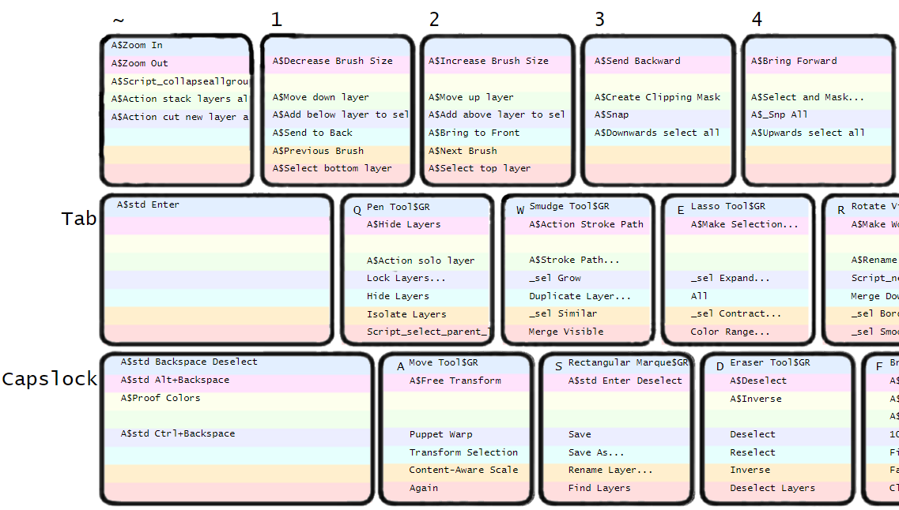

# Technical Art Demos

## Maya PolyUnchamfer & PolyUnbevel *(Geometric Reconstruction)*
### PolyUnchamfer & PolyUnbevel Timelapse:

### PolyUnchamfer Project Overview:

#### Maya API 2.0: Fast Topological Querying, Sorting, and Vector Calculations

- Maya PolyUnbevel and PolyUnchamfer leverage the Maya Python Api 2.0
(MIterators, MFNMesh etc.) for mesh traversal and topological sorting. MVector
and MMatrix are used for solver calculations.

- All the following scripts utilize a custom vector calculus library within
Maya API 2.0. In essence, it's an augmented version of Blender's
mathutils.geometry, covering a wide array of intersection and collision
scenarios (examples below). Since all vector and matrix calculations are done
utilizing Maya API 2.0 exclusively, no dependencies are in place for Numpy and
backwards compatibility with Maya 2018 - 2022 is maintained without an
additional third-party package eliminating any potential distribution
complications.

- [mathutils.geometry](https://docs.blender.org/api/current/mathutils.geometry.html)

#### Maya Cmds: Component Transformation And Topology Merging
- Much of the heavy lifting for these tools is done within the Maya API.
After solver calculations and topological sorting are finished,
final mesh manipulation is pushed to Maya Cmds. This allows for PolyUnchamfer
and PolyUnbevel to take advantage of Maya's built-in Undo functionality without
the overhead of a custom polyModifier subclassed plugin. This represents a best
of both worlds approach, Maya API 2.0 for fast vector and matrix operations, as
well as pulling internal geometry data, and Maya Cmds for final geometry
manipulation and undo.

#### Peformance Optimized: Minimized API Calls
- Much attention was paid into data organization during script execution. Since
API calls tend to incur a heavy performance penalty, at a high level, script
execution first deals with the Maya API exclusively, querying necessary
component level information with the MIterator classes, and making necessary
solver calculations with MMatrix and MVector. When transformations are
finalized, all component transformations are pushed to a single Maya CMDS call.
This allows for these tools to leverage Maya's built-in undo functionality,
despite heavy use of the Maya API.

#### *Edge-Vertex Valence Pair Values map to one of the following algorithms:*

#### Skew lines Closest Point of Approach Solver
- *A 3D implementation of the Closest Point of Approach Algorithim (CPA) for Collison Detection*
- [Distance of closest approach](https://en.wikipedia.org/wiki/Distance_of_closest_approach)
- [3d coordinate geometry skew lines](https://brilliant.org/wiki/3d-coordinate-geometry-skew-lines/)

#### Line Line Intersection Solver
- [3D Line Intersections](https://mathemerize.com/point-of-intersection-of-two-lines-in-3d/)

#### Line Plane Intersection Solver
- [Line Plane Intersection](https://handwiki.org/wiki/Line%E2%80%93plane_intersection)

#### Plane Plane Intersection Solver
- [Dual Plane Intersection](https://brilliant.org/wiki/3d-coordinate-geometry-intersection-of-planes/)

#### Solvers are triggered on a per edge basis
- Leveraging Maya API 2.0 Mesh Function Sets, topological sorting per
edge solver is determined by the each edge's edge-vertex valence pair.
- *Valence refers to the number of connected edges per vertex, with
two vertices per selected edge*

#### Topological Inference Example:

- Lets take one edge within a potential PolyUnchamfer input selection as a simple example:

```
Let Vertex_A and Vertex_B compromise the edge-verticies of Edge1:

Vertex_A valance = 4
Vertex_B valance = 3

Valence pair values are sorted in ascending wherein (4,3) -> (3,4)

Thus a Valence Pair of (4,3) => Line Plane Solver(3,4)
Simple!
```

In this way, each subsequent solver can be potentially triggered by a unique
edge-vertex valence pair on a per edge basis, as noted in the following section:

-----------------------------------------------------------------------
**Recursive 3-Way Skew Lines Solver (4,4):**
```
The 3-Way Skew Solver is triggered when selected edge(s) belong to a
trianglualr face in the case of corner chamfers and no intersections exists.
```


<details>
  <summary>3-Way Solve Diagram</summary>


</details>

-----------------------------------------------------------------------
**Skew Line Solver (4,4):**
```
The most common case, wherein no precise edge vector intersection exists.
```


-----------------------------------------------------------------------
**Line Line Solver (4,4):**
```
The most straight-forward case, wherein a perfect vector intersection exists
and no CPA Skew solver is required.
```


-----------------------------------------------------------------------
**Plane Plane Solver (3,3):**
```
A rare topological case, such as a partially chamfered cube.
```


-----------------------------------------------------------------------
**Line Plane Solver (4,3):**
```
A common topological case when a cylinder whose top face is an N-gon is
chamfered or when you chamfer the top face of a cube.
```


-----------------------------------------------------------------------
**Multi-Line Plane / Skew Line Solver (4+,4):**
```
A rare topological case wherein there are more than 4 edges connected to one
Edge-Vertex (see example below).

In this instance, UnChamfer will run a skew lines solver on each potential edge
option, and select the edge that yields the minimum distance to intersection
(CPA), assuming no intersection is found.
```


-----------------------------------------------------------------------
**Labeled Edge-Vertex Valence Pairs:**


-----------------------------------------------------------------------

### PolyUnbevel Project Overview:


#### Unbevel can be summarized in these 10 steps:
<ul>
<li>1. User Selection: 2 Edges -- adjacent to the beveled geometry.</li>
	<ul>
	<li>The World-Space coordinates of each edge-vertex are stored for each
	edge, allowing for edge selection recorvery post topology modification,
	when vertex and edge IDs have changed and the original selection IDs
	are no longer valid.</li>
	</ul>
<li>2. Edge ring selection is triggered, selecting the interior edge loops.</li>
	<ul>
	<li>In the rare case that the partial edge ring selection edge count
	is greater than the outer ring, a 3 edge selection can be made to indicate
	which part of the edge ring to trigger unbevel on. (See Timelapse)</li>
	</ul>
<li>3. The original selection is excluded from the current ring selection.</li>
<li>4. This interior edge ring is extended full edge loops and deleted.</li>
<li>5. Edge and Vertex IDs have changed due to topological modification of the mesh.</li>
	<ul>
	<li>Using each original edge's World-Space coordinates, edge centers are
	calculated and projected to the mesh via Maya API calls to MPointOnMesh.</li>
	<li>A minimum delta vector is calculated between the original edge
	vector mid-point and the mid-point of each newly created edge. </li>
	<li> The original edge selections yield MPointOnMesh delta vectors with
	a magnitude close to 0.</li>
	<li>This allows recovery of the original edge selection, despite the
	edges having a newly assigned edge ID.</li>
	<li> The original edge selection is then converted to faces.</li>
	</ul>
<li>6. The common face amongst each 'ConvertToFaces' call is filtered and
selected.</li>
<li>7. The current face selection is converted to edges.</li>
<li>8. The original selection edges are removed.</li>
<li>9. Edge Ring selection is triggered.</li>
<li>10. PolyUnChamfer is called.</li>
</ul>

-----------------------------------------------------------------------

## SuperCharge Configurator
### An Extensible Hotkey Layout Optimizer Supporting Multiple DCC Applications

#### SuperCharge supports Maya, Photoshop, Zbrush, Fusion360, Moi3d, and 3DCoat so far!


#### Optimize Artist Workflows with a more efficent hotkey layout

- [x] Increase Artist Productivity with a fully customizable layout that
requires minimal setup time.
- [x] Reduce ulnar deviation and RSI by ergonomically prioritizing the home row keys whilst
still being flexible enough for full customization if needed (including Left vs Right hand support).
- [x] Easily integrate new applications as production needs change.
- [x] Integrate a Python to Autohotkey Parser, allowing for mapping overrides
that are not natively supported in a specific DCC application.
- [x] Autohotkey code is procedurally generated, commented, and documented for
easy reference like so.
```Autohotkey
#IfWinActive ahk_exe Photoshop.exe
{
	; Decrease Brush Size
	!1::
	{
	    SendInput, {[}
	    return
	}
	...
}
```
- [x] Fully automate the generation of keymap chart for each keyboard layout
with an HTML webpage, including Autohotkey mappings.
- [x] Generate native application configuration data, such as a UserConfig.kys
file (Photoshop), UserHotkeyString XML (Fusion360), Moi.ini (Moi3d),
StartupHotkeys.txt (Zbrush), etc.
- [x] Easy to update, diff, and backup configurations

#### Project Artifacts

Photoshop example




Look at photoshops configuration file
reverse engineer the data storage format and ordering
derive 3 main command types
	static unique id
	dynamic no unique id
	tools stackable groups vs non stackable
Flood the UI with all possible keycombinations
build a map between UI representation of a command and its internal xml storage representation
determine a sort order for left vs right handed artists
log artist sessions in photoshop and sort most used vs least used commands according to frequency
reconfigure the ui to be most accessable to the artist
On top of that override photoshops reserved keys for things like brush size and layer manipulation
using autohotkey
Parsing photoshop style input sequences to autohotkey syntax hotkey strings
	output an authotkey file with these recursive maps

when I hit alt 1 I want to decrese brush size
again keeping the data self documenting I automatically generate a comment string as well

Finally combining both the recursive autohotkey maps as well as the photoshop
mappings I parse those sequence strings to be readable in html visualizer,
which is a simple webpage whose html slots (html hotkey sequence as
key)at each keyboard location take in a text string
(value)
 ------------------------------------------------------------------------------
## MAYA PROJECTS BREAKDOWN
Unchamfer ->
Using mayas lower level python api, which really is a procedurally generated
python api that has a 1 to 1 binding to its c++ api via SWIG
simplified wrapper and interface generator
https://www.swig.org/

Vector Line Intersection:
https://vicrucann.github.io/tutorials/3d-geometry-algorithms/#skew-lines-geometry-shortest-distance-and-projection-of-one-skew-line-onto-another
http://paulbourke.net/geometry/pointlineplane/

CPA algorithim:
https://core.ac.uk/download/pdf/74237799.pdf

Alternate case:
non perfect intersections = CPA solver take the minimum on each vector then average

EdgeCase:
corner bevels of a 3 way intersection (triangle corner) Cpa Solving
This required recursive bevel operations, performing the solver twice

The first challenge apart from building a math library that did not exist in
maya (extending the API) was
mesh traversal
how to traverse along an edge loop or ring
how to identify branch points (triangles)
how to organize and store the data in such a way that I know the directions
of each vector, what to input where, and keep tract of what to finall move
to a resulting location

at triangles
	how to do recursive 3 way solvers between A B C vectors

(Something I think would be useful in our javascript performance issue)
Performance issues, cmds wasnt cutting it and api forces you to compact your
data into arrays and reduce the api calls by tightly organizing your data
calling eveyrthing you need at once and sorting it yourself.

CmdsSnapalign
Relative spacing on or off to stack objects
Built a snapping system from the ground up
Calculates the face center of a polygon even if a real vertex does not exist
easy align objects
all the math same challenges data and math
select neraest face center
edge center
or vertex
purely based on cursor position no clicking
then snap and align
predictive
always Y UP
works with vertexs edges and faces too

Smart Tool Handle Activation: (Lazy Boi Mode)
Based on Manipulator to Camera Space projection, SnapAlign can calculate the
nearest active tool handle to the cursor, it does this by first projecting
the gizmo axis onto the camera plane, then does a 2D vector angle calculation
between the projected gizmo axis angles (-X -Y -Z +X +Y +Z) and the cursor
to projected gizmo Vector, by finding the minimum delta vector, we can dervice
the "closest" active tool handle to cursor.
See the demo here:

This can easily be extended to multiple tools, including duplicate special,
wherein the active axis for the duplicate operation is determined by the cursor
position! No more menus!

SnapAlign in action, with Smart Tool Handle Activation turned ON:

PRIMALIGN
Aligns objects to the component (edge center face center OR vertex normal)
under the cursor. If the object is a newly created primitive at world center
PrimAlign will move and bake the selected Object's Object Space -Y bounding box
to the the grid floor prior to alignment transform. This allows for predictable
alignment of the object's ground plane to the target geometry's alignment
plane.

Secondary Function, when an active axis of the move tool is selected and a component
is selected, PrimAlign will aim the active axis towards the component center.
Either edge center or face center for edges and faces, or vertex if a vertex is selected.

RECORD WITH PLANAR DETECTION ON
PLANEFLATTEN
Consecutive Faces selected will align the first face to the second face ALONG
the connected edges as vector Angles

Seperated Face selections will porject along the vectors of each face, results
in a skew like effect per face towards the target plane alignment

Select 3 vertex of a non planar face and planar align that face while respecting
surround geometry


